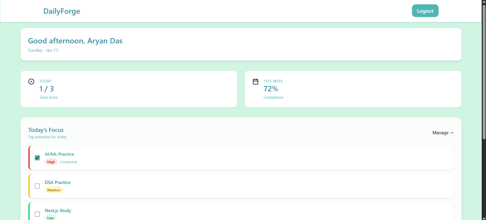
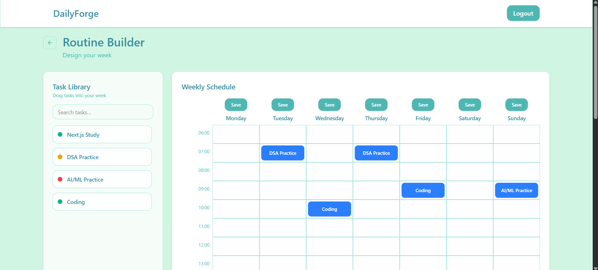
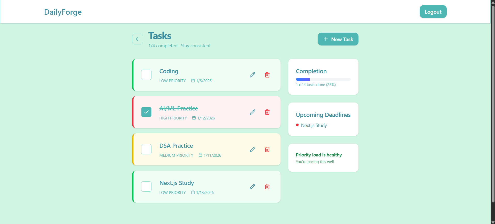
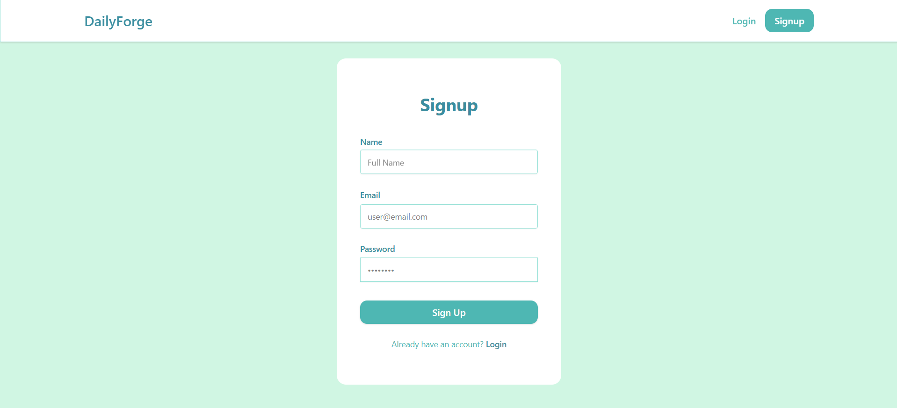

<div align="center">

# 🌌 NovaSync

### Sync your workflow. Forge your future.

**NovaSync** is an open-source, full-stack MERN productivity powerhouse. It combines an intelligent weekly routine builder, a GitHub-style contribution heatmap, an AI-powered smart assistant, comprehensive debt tracking, and a built-in Lofi Focus session player — all wrapped in a stunning, modern UI.


[🌐 Live Demo](#-live-demo) · [⚡ Quick Start](#-quick-start) · [✨ Features](#-features)

</div>

---

## 🚀 Project Overview

Most productivity tools force you into rigid boxes. **NovaSync** adapts to how you actually work. Whether you're planning your week, tracking finances, or buckling down for a deep-work sprint, NovaSync provides all the tools you need in one cohesive ecosystem.

**Key Highlights:**
- ⚡ **Drag-and-drop Weekly Planner** powered by `@dnd-kit`
- 🧠 **AI Smart Assistant** integrated directly into your workflow
- 🎵 **Native Lofi Focus Sessions** with Pomodoro timers and aesthetic widgets
- 💸 **Debt & Finance Tracking** to keep your budget in check
- 🔥 **GitHub-Style Productivity Heatmap** to visualize your consistency

---

## 🌐 Live Demo

| Service  | URL |
|----------|-----|
| 🖥️ Frontend | [https://frontend-krishnas-projects-7d6accd9.vercel.app/](https://frontend-krishnas-projects-7d6accd9.vercel.app/) |


*(Note: Free-tier backends may take 30-60 seconds to spin up on initial load)*

---

## ✨ Features

### 🗓️ Smart Routine Builder
- Drag tasks from your library onto a **7-day weekly grid**.
- Time-slot-based placement with visual feedback.
- Overlap detection prevents conflicting task placement on the same day.

### 📊 Productivity Heatmap
- **Interactive Contribution Heatmap**: A premium, GitHub-style 371-day productivity calendar.
- Real-time calculations of current streaks, longest streaks, and total productive days.
- Smart tooltips and micro-animations for an elevated user experience.

### 🤖 AI Panel Integration
- **Context-Aware Assistance**: Chat with an AI directly from the dashboard to get schedule optimizations, task breakdowns, and productivity tips.

### 🎧 Lofi Focus Sessions
- **Built-in Pomodoro Timer**: Switch between Focus, Short Break, and Long Break modes.
- **Native Audio Player**: Stream soothing, high-quality Lofi beats directly in the app without heavy YouTube iframe restrictions.
- **Dynamic Aesthetic UI**: Expandable mini-player with beautiful album art and seamless controls.

### 💸 Debt Dashboard
- Track who owes you, and who you owe.
- Visual breakdown of financial obligations integrated alongside your daily tasks.

### 🔐 Secure Authentication
- JWT-based session management with bcrypt password hashing.

---

## 📸 Screenshots

Here is a visual overview of NovaSync in action:

<details>
<summary><b>🔥 Dashboard & Heatmap</b></summary>

</details>

<details>
<summary><b>🗓️ Weekly Routine Builder</b></summary>

</details>

<details>
<summary><b>📋 Task Library</b></summary>

</details>

<details>
<summary><b>🔐 Authentication (Signup)</b></summary>

</details>

---

## 🏗 Tech Stack

**Frontend (Client)**
- **Framework**: React 19 + Vite
- **Styling**: Tailwind CSS v4 + Lucide Icons
- **State Management**: React Hooks (Context/State)
- **Drag & Drop**: `@dnd-kit/core`
- **Routing**: React Router DOM
- **Deployment**: Vercel

**Backend (Server)**
- **Runtime**: Node.js
- **Framework**: Express.js
- **Database**: MongoDB + Mongoose
- **Authentication**: JWT & bcryptjs
- **AI Integration**: Google Generative AI (Gemini)
- **Deployment**: Render

---

## ⚡ Quick Start

### 1. Clone the repository
```bash
git clone https://github.com/krishna-thadani/NovaSync.git
cd NovaSync
```

### 2. Setup the Backend
```bash
cd backend
npm install
```
Create a `.env` file in the `backend` folder:
```env
PORT=5000
MONGODB_URI=your_mongodb_connection_string
JWT_SECRET=your_jwt_secret
GEMINI_API_KEY=your_gemini_api_key
```
Start the backend server:
```bash
npm start
```

### 3. Setup the Frontend
```bash
cd ../frontend
npm install
```
Create a `.env` file in the `frontend` folder:
```env
VITE_API_URL=http://localhost:5000/api
```
Start the development server:
```bash
npm run dev
```

---

---

## 🚀 Future Enhancements

- Real-time team collaboration and shared workspaces
- Mobile application support for Android and iOS
- Advanced productivity analytics and reporting
- Smart notifications and task reminders
- Calendar integration with external productivity tools


